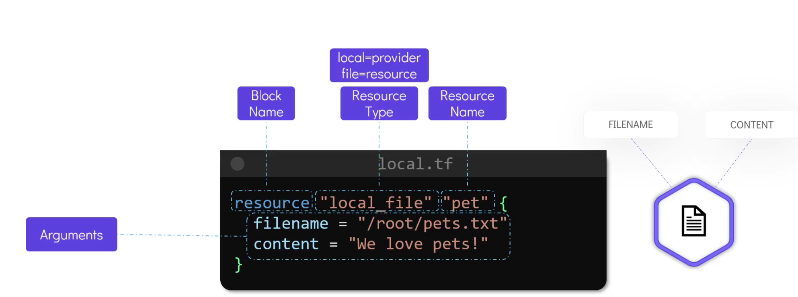

# 3. Getting Started with Terraform — *20:30*

## Notes

### 1. HCL Syntax

HashiCorp Configuration Language (HCL) describes infrastructure as a set of **blocks**. The general shape is:

```hcl
<block> <parameters> {
    key1 = value1
    key2 = value2
}
```

- **block** — the type of object being defined (e.g. `resource`, `provider`, `variable`, `output`).
- **parameters** — for a `resource` block these are the **resource type** and a **local name**, e.g. `"local_file"` (type) and `"my_file"` (name).
- **arguments** — the `key = value` settings inside the block.

#### Example: create a local file

```hcl
resource "local_file" "my_file" {
    filename = "Automate.txt"
    content  = "GenAI is great"
}
```



This uses the `local` provider's `local_file` resource to create `Automate.txt` with the given content.

> **Provider documentation:**
> - [Terraform Registry — Browse Providers](https://registry.terraform.io/browse/providers)
> - [`hashicorp/local` provider docs](https://registry.terraform.io/providers/hashicorp/local/latest/docs)
>   - [`local_file` resource](https://registry.terraform.io/providers/hashicorp/local/latest/docs/resources/file)
>   - [`local_sensitive_file` resource](https://registry.terraform.io/providers/hashicorp/local/latest/docs/resources/sensitive_file)

### 2. Terraform Workflow

After writing the configuration file (`.tf`), run the core commands in order:

```bash
terraform init       # initialize the directory and download required providers
terraform validate   # (optional) check the configuration for syntax/consistency
terraform plan       # preview the changes Terraform will make (dry-run)
terraform apply      # create/update the infrastructure
terraform show       # inspect the current state / created resources
```

### 3. Update and Destroy Infrastructure

- **Update** — edit the arguments in the `.tf` file (e.g. change `content`), then re-run `terraform apply`. Terraform compares desired vs current state and applies only the difference.
- **Destroy** — run `terraform destroy` to remove all resources managed by the configuration.