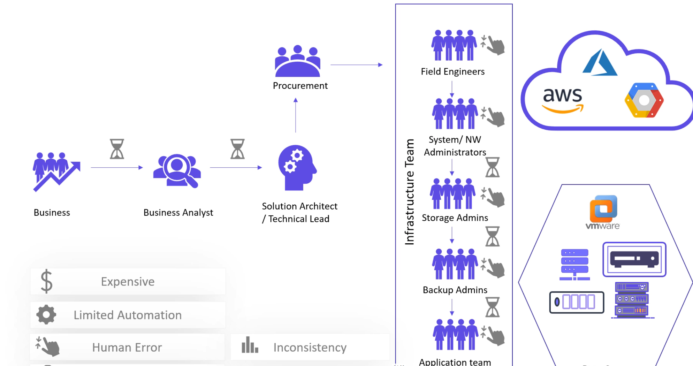

# Terraform

Learning notes and hands-on code for the **Terraform Basics** course (KodeKloud — Vijin Palazhi).
This repo is organized section-by-section following the course syllabus.

> **Full syllabus with durations:** see [Contents.md](Contents.md)

## What is Terraform?

Terraform is an **Infrastructure as Code (IaC)** tool used to provision and automate infrastructure.

- Created by **HashiCorp**. The license changed from open source (MPL 2.0) to the **Business Source License (BSL 1.1)** in 2023.
- HashiCorp was **acquired by IBM** (announced April 2024, closed February 2025).

### Terraform vs Ansible

| Tool | Primary Purpose |
|------|-----------------|
| **Terraform** | Infrastructure **provisioning** — automates creating infra (servers, databases, networks). |
| **Ansible** | **Configuration management** — installs/updates software and manages existing infra (often the infra Terraform created). |

## Repo Structure

Each course section lives in its own numbered folder, with a section `.md` containing that module's topic/duration table and a notes area.

| Folder | Section |
|--------|---------|
| [01_Introduction](01_Introduction/) | Introduction |
| [02_Introduction-to-Infrastructure-as-Code](02_Introduction-to-Infrastructure-as-Code/) | Introduction to Infrastructure as Code |
| [03_Getting-Started-with-Terraform](03_Getting-Started-with-Terraform/) | Getting Started with Terraform |
| [04_Terraform-Basics](04_Terraform-Basics/) | Terraform Basics |
| [05_Terraform-State](05_Terraform-State/) | Terraform State |
| [06_Working-with-Terraform](06_Working-with-Terraform/) | Working with Terraform |
| [07_Terraform-with-AWS](07_Terraform-with-AWS/) | Terraform with AWS |
| [08_Remote-State](08_Remote-State/) | Remote State |
| [09_Terraform-Provisioners](09_Terraform-Provisioners/) | Terraform Provisioners |
| [10_Terraform-Import-Tainting-and-Debugging](10_Terraform-Import-Tainting-and-Debugging/) | Terraform Import, Tainting & Debugging |
| [11_Terraform-Modules](11_Terraform-Modules/) | Terraform Modules |
| [12_Terraform-Functions-and-Conditional-Expressions](12_Terraform-Functions-and-Conditional-Expressions/) | Terraform Functions & Conditional Expressions |
| [13_Course-Conclusion](13_Course-Conclusion/) | Course Conclusion |

---

## Notes

### Challenges with the Existing (Traditional) Setup



1. **Slow provisioning** — manually setting up servers, storage, and networks is time-consuming and delays delivery.
2. **Human error & inconsistency** — manual/click-ops steps drift over time, so environments (dev, staging, prod) don't match.
3. **No version control or audit trail** — changes aren't tracked, making it hard to know who changed what, or to roll back.
4. **Poor scalability** — scaling up or down on demand is hard to do quickly and reliably by hand.
5. **High maintenance & cost** — repetitive manual effort, underused resources, and configuration drift increase operational overhead.

### Types of IaC Tools

1. **Configuration Management** — install and manage software in existing infra; idempotent, supports targeted updates.
   - Ansible
   - Puppet
   - SaltStack
2. **Server Templating** — build VM or Docker images; promotes immutable infrastructure.
   - Docker
   - HashiCorp Packer
   - Vagrant
3. **Infrastructure Provisioning** — provision servers, databases, network components, etc.
   - HashiCorp Terraform
   - AWS CloudFormation

### Why Terraform?

- **Multi-cloud** support.
- Create or destroy infrastructure quickly.
- Uses **providers** to talk to platforms (AWS, Azure, GCP, etc.).
- **Declarative** code — you define the desired state, Terraform reconciles current → desired.
- Workflow: **Init → Plan → Apply**.
- Tracks infrastructure **state**.

### Terraform Configuration Files (`.tf`)

```hcl
<block> <parameters> {
    <arguments>
}
```

- **block** — the action being defined (e.g. infra provisioning → `resource` block, output → `output` block, variables → `variable` block).
- **parameters** — name/type of the resource (e.g. an AWS EC2 instance, exposed via a provider).
- **arguments** — key/value settings for that block.

### Core Workflow

Initialize → Validate → Plan (dry-run) → Apply → Destroy

```bash
terraform init          # initialize the working directory / download providers
terraform validate      # (optional) check configuration syntax
terraform plan          # preview changes (dry-run)
terraform apply         # apply changes
terraform destroy       # tear down managed infrastructure
```
